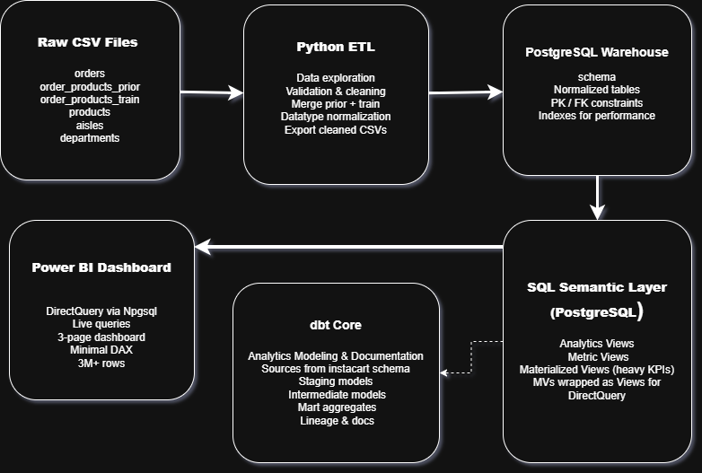
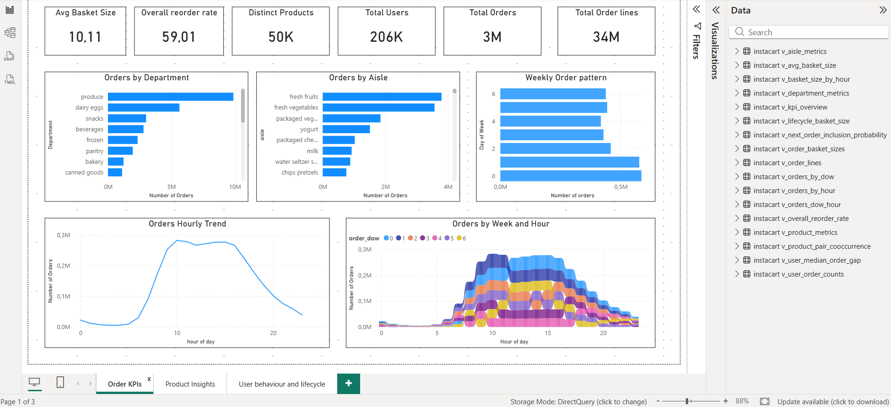
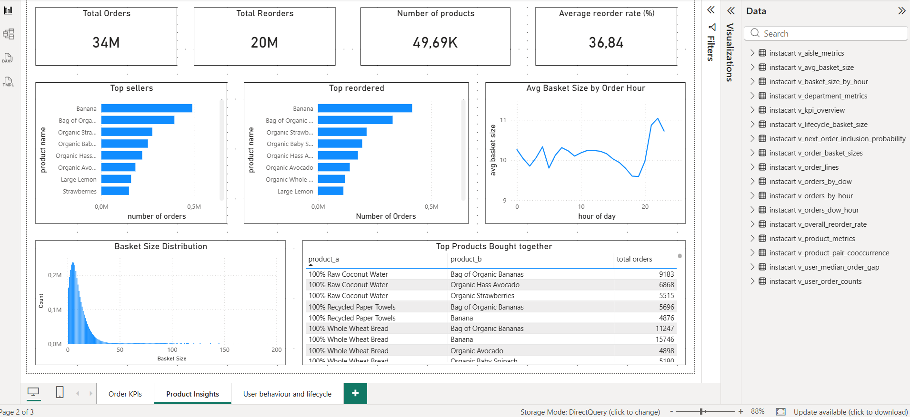
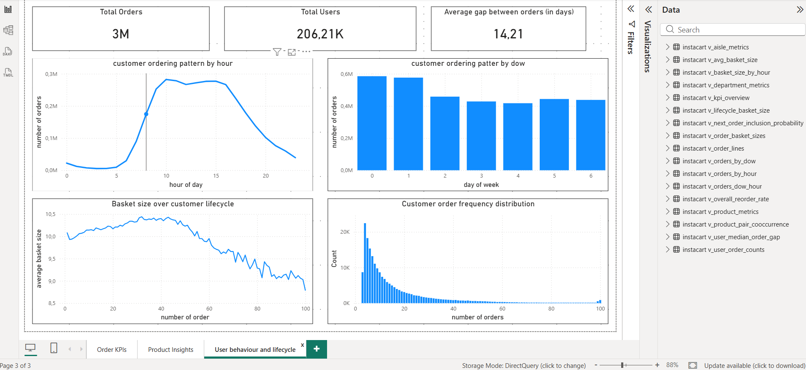

---

# 📦 InstaCart Retail Analytics Engineering Pipeline

**PostgreSQL-centric retail analytics pipeline with a SQL semantic layer and live Power BI dashboards (3M+ rows), complementary by dbt for modeling, documentation, and lineage.**


---

## 🚀 Project Objective

Design and deliver a production-style retail analytics warehouse using PostgreSQL as the primary transformation and semantic layer. Core business logic and KPIs are implemented as optimized SQL views and materialized views, and served to Power BI via DirectQuery for live, high-volume analysis.
After validating correctness and performance at the database layer,dbt was introduced to replicate and document selected transformations, demonstrating staging -> intermediate -> mart modeling patterns, and generate lineage documentation without replacing the underlying SQL semantic layer.

---

## 📈 Business Focus & Decision Support

This project is designed to simulate how cross-functional business teams consume analytics in practice, with an emphasis on clarity, trust, and decision usability rather than tool-centric outputs.

Key focus areas:
- Translating business questions into clear, decision-oriented KPIs
- Ensuring data clarity, consistency, and metric reliability across reports
- Delivering stakeholder-ready dashboards that support operational and strategic decision-making
- Balancing speed, accuracy, and performance to enable timely insights
- Structuring analytics outputs so they can be easily explained, trusted, and acted upon

The technical implementation serves the primary goal of enabling reliable analysis and better business decisions, rather than showcasing tools in isolation.

---

## 🛠️ Tech Stack

* **Python**: Data loading and preprocessing
* **Python packages**: pandas,sqlalchemy,os
* **PostgreSQL**: Data warehouse, schemas, indexing, materialized views,
* **SQL**: Transformation logic, KPI calculations.
* **dbt Core**: Staging, intermediate, and mart models
* **Power BI**: DirectQuery dashboards on 3M+ rows
* **Git**: Version control (~50 commits,incremental developement)
* **Npgsql (.NET PostgreSQL Driver)**: for reliable and high-performance connection between PostgreSQL and Power BI, allowing to use DirectQuery for live dashboards 

---

## 📊 Dataset

This project uses the public [Instacart Online Gorcery Analysis Dataset](https://www.kaggle.com/datasets/yasserh/instacart-online-grocery-basket-analysis-dataset) dataset from Kaggle (3M+ rows of orders,products,order_products,aisles,department).

---

## 🏗️ Architecture Overview



The pipeline follows a database-first analytics engineering approach. Transformation logic and KPIs are first implemented and optimized directly in PostgreSQL using SQL views and materialized views to ensure correctness and performance. 
Power BI consumes these prepared views via DirectQuery,enabling live analysis over 3M+ rows. dbt is introduced afterwards to replicate selected transformations, apply layered modeling patterns, and generate lineage documentation without disrupting the primary BI consumption layer.

---

## 🗄️ 1. Data Warehouse Design

Engineered a PostgreSQL-centric analytics warehouse with clearly separated raw data, base tables, and a SQL semantic layer.

The warehouse schema was manually designed, including primary and foreign key relationships, indexing strategies, and query-optimized structures. Core business logic and KPIs were implemented directly in SQL using views and materialized views, with heavy computations pre-aggregated for performance.

Materialized views were selectively wrapped into standard views to ensure compatibility with Power BI DirectQuery, enabling live dashboards over 3M+ rows while maintaining query performance and stability.


---

## 🔄 2. SQL Transformations & Optimization

All transformation logic and KPI calculations are implemented directly in SQL at the database layer level to ensure correctness, performance, and reuse across downstream consumers. Performance is optimized using indexing strategies and materialized views before introducing dbt for transformation modeling and documentation.

---

## 🧱 3. dbt Modeling (Exploration and Documentation layer)

After validating core SQL logic at the database level, selected transformations were replicated and modeled in dbt to explore analytical engineering workflows, layering patterns (staging → intermediate → marts), and generate lineage documentation. 
The primary BI layer continues to consume optimized PostgreSQL views and materialized views via DirectQuery. Additional details are documented in dbt/README.md.


---

## 📊 4. Power BI Dashboard (DirectQuery)

The Power BI dashboard consumes only prepared PostgreSQL views, keeping DAX minimal and business logic centralized in the database. The dashboard is connected live via DirectQuery and designed to handle 3M+ rows in real time.





---

## 📂 Repository Structure

```text
Retail_Analytics_Engineering_Pipeline/
├── dashboards/
│   ├── dashboard.pbix
│   ├── dashboard.pdf
│   ├── dashboard_1.png
│   ├── dashboard_2.png
│   └── dashboard_3.png
│
├── data_raw/
│   ├── aisles.csv
│   ├── departments.csv
│   ├── orders.csv
│   ├── order_products__prior.csv
│   ├── order_products__train.csv
│   └── products.csv
│
├── data_clean/
│   ├── aisles.csv
│   ├── departments.csv
│   ├── orders.csv
│   ├── order_products.csv
│   └── products.csv
│
├── dbt/
│   ├── dbt_project.yml
│   ├── profiles.yml
│   ├── models/
│   │   ├── staging/
│   │   │   ├── stg_aisles.sql
│   │   │   ├── stg_departments.sql
│   │   │   ├── stg_orders.sql
│   │   │   ├── stg_order_products.sql
│   │   │   └── stg_products.sql
│   │   ├── intermediate/
│   │   │   └── int_order_basket_sizes.sql
│   │   └── mart/
│   │       ├── agg_orders_by_dow.sql
│   │       ├── agg_product_metrics.sql
│   │       ├── fct_kpi_overview.sql
│   │       └── fct_orders_by_dow.sql
│   └── sources.yml
│
├── images/
│   ├── architecture.png
│   ├── dbt_graph.png
│   ├── schema.png
│   └── views_and_mvs.png
│
├── notebooks/
│   ├── 01_explore_raw.ipynb
│   ├── 02_clean_transform.ipynb
│   └── 03_load_to_postgres.ipynb
│
├── sql/
│   ├── 01_schema.sql
│   ├── 02_test_load.sql
│   ├── 03_indexes.sql
│   ├── 04_analytics_queries.sql
│   ├── 05_views.sql
│   ├── 06_materialized_views.sql
│   └── 07_metric_views.sql
│
└── ETL_RUN_LOG.md
```

______________________________________________
---

## 📝 How to Run Locally


1. Clone the repository and set up the Python environment.
2. Run the ETL notebooks to load and clean the raw Instacart data into PostgreSQL.
3. Execute the SQL scripts under `sql/` (schemas, indexes, views, and materialized views) to prepare the analytics layer.
4. Open Power BI and connect to PostgreSQL via DirectQuery to the prepared views.

> Note: dbt models in this repository were developed to replicate and document selected transformations and generate lineage. The Power BI dashboard consumes optimized PostgreSQL views and materialized views directly.

---

## 👤 Author

Raga, Junior Analytics Engineer (Analytics Engineering & BI) | Berlin, Germany

---
